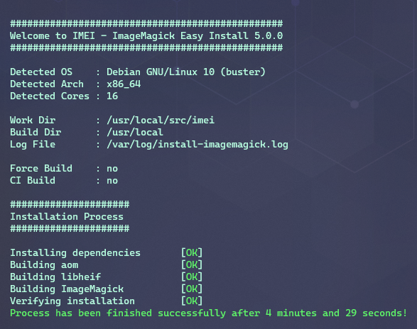

<div align=center>

# IMEI - ImageMagick Easy Install
#### Automated ImageMagick compilation from sources for Debian/Ubuntu including advanced delegate support.

[](https://github.com/SoftCreatR/imei/actions?query=workflow%3ATestBuild) [](https://github.com/SoftCreatR/imei/actions?query=workflow%3AShellcheck)

[](https://github.com/SoftCreatR/imei/commits/main) [](https://github.com/SoftCreatR/imei/releases) [](LICENSE.md)  [](https://github.com/SoftCreatR/imei/blob/main/imei.sh)

[](https://app.codacy.com/gh/SoftCreatR/imei/dashboard) [](https://www.codefactor.io/repository/github/softcreatr/imei)

</div>

---

<div align="center">

<a href="#features"> Features<a> •
<a href="#compatibility"> Compatibility</a> •
<a href="#usage"> Usage</a> •
<a href="#roadmap"> Roadmap</a> •
<a href="#contributing"> Contributing</a> •
<a href="#license"> License</a>



</div>

---

## Features

* Compiles the latest ImageMagick release
* Installs ImageMagick or updates ImageMagick package previously installed (via IMEI)
* Additional HEIF support
* Additional HEIX support
* Additional AVIF support

---

## Compatibility

Every IMEI build will be automatically tested against the latest Ubuntu LTS Versions (16.04 and newer) using GitHub Actions. Compatibility with other operating systems (such as Debian 10) is tested manually.

### Operating System

#### Recommended

* Ubuntu 20.04 LTS (__Focal__ Fossa)
* Ubuntu 18.04 LTS (__Bionic__ Beaver)
* Debian 10 (__Buster__)
* Raspbian 10 (__Buster__)

#### Also compatible

* Ubuntu 19.10 (__Eoan__ Ermine)
* Ubuntu 16.04 LTS (__Xenial__ Xerus)
* Debian 9 (__Stretch__)
* Raspbian 9 (__Stretch__)

---

## Usage

### One-Step Automated Install

```bash
bash <(wget -qO - dist.1-2.dev/imei)
```

### Alternative Install Method

```bash
git clone https://github.com/SoftCreatR/imei
cd imei
sudo ./imei.sh
```

### Verify installer integrity

Though the installer performs a self check upon startup, you can also perform it manually.
To do so, `openssl` is required:

```bash
wget dist.1-2.dev/imei && \                                            # Download IMEI
wget 1-2.dev/imei/imei.sh.sig && \                                     # Download signature file
wget 1-2.dev/imei/public.pem && \                                      # Download public key
openssl dgst -sha512 -verify public.pem -signature imei.sh.sig imei.sh # Verify
```

### Alternative integrity check

```bash
git clone https://github.com/SoftCreatR/imei
cd imei
openssl dgst -sha512 -verify public.pem -signature imei.sh.sig imei.sh
```

#### Options available

Currently available build options are

* `--imagemagick-version` : Build the given ImageMagick version (e.g. `7.0.10-28`)
* `--aom-version` : Build the given aom version (e.g. `2.0.0`)
* `--libheif-version` : Build the given libheif version (e.g. `1.8.0`)
* `--log-file` : Log everything to the file provided
* `--work-dir` : Download, extract & build within the directory provided
* `--build-dir` : Build target directory
* `--force` : Force building of components, even if they are already installed in a newer or the latest version
* `--no-sig-verify` : Disable signature verification on startup

**Default options** :

<!-- versions start -->
* ImageMagick version: `7.0.10-50`
* libaom version: `2.0.1`
* libheif version: `1.10.0`<!-- versions end -->
* Log File: `/var/log/install-imagemagick.log`
* Work Dir: `/usr/local/src/imei`
* Build Dir: `/usr/local`

---

## Roadmap

* [x] Verify installer signatures
* [ ] Add ImageMagick modules choice
* [ ] CentOS compatibility

## Contributing

If you have any ideas, just open an issue and describe what you would like to add/change in IMEI.

If you'd like to contribute, please fork the repository and make changes as you'd like. Pull requests are warmly welcome.

## License

[ISC](LICENSE.md) © [1-2.dev](https://1-2.dev)
